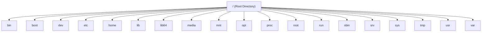

# 🚀 Day 1 – Introduction to DevOps

---

## 📌 1. Introduction to DevOps

DevOps is a **culture, mindset, and set of practices** that brings Development (Dev) and Operations (Ops) teams together to deliver software faster, more reliably, and continuously.

---

### 🔑 Key Principles of DevOps

- 🤝 **Collaboration** – Breaking silos between development, operations, and other teams.
- ⚙️ **Automation** – Automating repetitive tasks to reduce human error.
- 🔄 **Continuous Integration & Continuous Deployment (CI/CD)** – Frequent integration of code and automated deployment.
- 📊 **Monitoring & Feedback** – Real-time monitoring to quickly identify and fix issues.

---

### ✅ Benefits of DevOps

- 🚀 Faster time to market  
- 🤝 Improved collaboration and communication  
- 🛠 Higher software quality  
- 📈 Enhanced scalability and reliability  

---

## 🏢 2. How an IT Company Works

Understanding how an IT company functions helps in understanding the role of DevOps.

---

### 🔄 General Workflow

#### 📍 Project Initiation
- Requirement gathering
- Feasibility study
- Budget allocation

#### 💻 Development
- Coding by developers
- Regular commits to version control systems (e.g., Git)

#### 🧪 Testing
- Automated and manual testing
- Identifying and fixing bugs

#### 🚀 Deployment
- Releasing software to production
- Ensuring high availability and minimal downtime

#### 🔧 Maintenance
- Monitoring performance
- Applying updates and patches

---

### 🏢 Key Departments

| Team | Responsibility |
|------|---------------|
| 👨‍💻 Development Team | Builds the application |
| 🧪 Testing Team (QA) | Ensures software quality |
| ⚙️ Operations Team | Manages infrastructure and deployment |
| 📊 Business Team | Engages with clients and stakeholders |

---

## 💻 3. What is an Application?

An application is a software program designed to perform specific tasks for users or systems.

---

### 📱 Types of Applications

- 🌐 **Web Applications** – Accessible via browsers (e.g., Gmail, Facebook)
- 📱 **Mobile Applications** – For smartphones (e.g., WhatsApp, Instagram)
- 🖥 **Desktop Applications** – Installed on computers (e.g., MS Word, Photoshop)
- 🧩 **Microservices** – Modular applications with independent components

---

### 🏗 Key Components of an Application

- 🎨 **Frontend** – User Interface (UI)
- ⚙️ **Backend** – Server-side logic
- 🗄 **Database** – Stores application data

---

## 👨‍💻 4. Developers vs Testers vs DevOps

### 🔍 Roles and Responsibilities

| Role | Responsibilities |
|------|------------------|
| 👨‍💻 Developers | - Write application code <br> - Fix bugs and add features |
| 🧪 Testers | - Perform functional & performance testing <br> - Report issues |
| 🚀 DevOps | - Manage CI/CD pipelines <br> - Automate infrastructure <br> - Monitor production systems |

---

### 🎯 Key Differences

#### 🔎 Focus
- Developers → Writing code  
- Testers → Validating software quality  
- DevOps → Bridging development & operations  

#### 🛠 Tools Used

| Role | Tools |
|------|------|
| Developers | IDEs, Git, Debugging tools |
| Testers | Selenium, JUnit, LoadRunner |
| DevOps | Jenkins, Docker, Kubernetes, Terraform |

---

## 🎯 Conclusion

DevOps plays a crucial role in modern IT companies by enabling smooth collaboration and faster software delivery.

Understanding:
- How IT companies work  
- What applications are  
- Roles of Developers, Testers, and DevOps Engineers is essential for every aspiring DevOps professional.

---


# 🚀 Day 2: The Strategic Imperative of DevOps

---

## 🐧 Top Features of Linux

Linux is an **open-source operating system** mainly used on servers, cloud, DevOps, and production systems.

---

## 🔑 Key Features (with Examples)

### 🆓 Open Source
- Source code is free  
- Anyone can modify it  
👉 Example: Google, Amazon, Facebook customize Linux for their systems  

---

### 🔐 Secure
- Very few viruses  
- Strong file permission system (rwx)  
👉 Example: Banks & cloud servers run on Linux  

---

### 🏗 Stable
- Servers run months/years without restart  
👉 Example: Amazon servers don’t reboot daily like Windows  

---

### 👥 Multi-user & Multi-tasking
- Multiple users can work at the same time  
👉 Example: 100 developers logged into one Linux server  

---

### 💻 Command-line Power
- Automation using shell scripts  
👉 Example: Backup script running every night  

---

## 🎯 Interactive Question
👉 **Why do you think companies prefer Linux over Windows for servers?**

---

## 🌍 Linux Everywhere
- Powers over 90% of cloud infrastructure  
- Used in supercomputers, IoT devices, and embedded systems  
- Essential for DevOps environments  

### Examples:
- 📱 Mobile → Android  
- ☁ Cloud → AWS, GCP, Azure  
- 🖥 Servers → Websites, APIs  
- ⚙ DevOps Tools → Docker, Kubernetes  

---

## 🚀 Unlocking Linux Careers
- Proficiency in Linux opens doors to roles in:
  - System Administration  
  - Linux Administrator  
  - DevOps Engineer  
  - Cloud Engineer  
- High demand for Linux skills across industries  

⚠ Linux is **NOT optional** if you want cloud or DevOps jobs.

---

# ☁ Why AWS Stands Out in the Cloud Market

- Market leader with a broad range of services  
- Exceptional scalability and reliability  
- Comprehensive global infrastructure  

---

## 🏆 Why AWS is #1

- First cloud provider  
- Largest market share  
- Trusted by startups & enterprises  

---

## 🔎 Key Reasons

- Global infrastructure  
- Pay-as-you-go model  
- Highly secure  
- Huge service ecosystem  

---

## 📦 Overview of AWS

- Provides compute, storage, networking, and database services  
- Popular services: EC2, S3, RDS, Lambda  
- Pay-as-you-go pricing model  

💡 Instead of buying a ₹5 lakh server, you rent a server for ₹10/hour.

---

# 🌟 Customer Success Stories

### 🎬 Netflix
Scalable streaming platform  

### 🚀 NASA
Data storage and processing  

---

## ❗ Problem Netflix Faced

- Millions of users  
- Different countries  
- Peak traffic at night & weekends  
- Traditional servers cannot scale fast  

### Example:
On Friday night at 9 PM, suddenly 1 million people press PLAY 😳  
If servers are limited → app crashes.

---

## ✅ How AWS Helped Netflix

Netflix moved fully to AWS:

- EC2 → Run streaming services  
- S3 → Store video content  
- Auto Scaling → Add servers automatically  
- CloudFront → Fast video delivery worldwide  

---

## 🔄 What Happens in Real Time

1. User clicks Play  
2. AWS checks nearest server  
3. Video streams from closest location  
4. If traffic increases → AWS adds more servers  

---

## 💡 Key Learning for Students

AWS allows automatic scaling without manual work.

👉 **What would happen if Netflix used only 5 physical servers?**

---

# 📈 Scalability and Flexibility of Business with AWS

- Elastic scaling to meet demand  
- Supports diverse workloads and applications  
- Enables rapid deployment of new features  

---

# ⚖ Comparing AWS with Competitors

| Provider | Strength |
|----------|----------|
| AWS | Largest service catalog and global reach |
| Azure | Strong integration with Microsoft products |
| Google Cloud | Focus on data analytics and AI |

---

# 🚀 Why DevOps is a Growing Career Field

- Organizations prioritize faster software delivery and innovation  
- Essential for modern software development practices  

---

## 🏗 Old Model
Developer → throws code  
Ops → deploys manually  
Slow & error-prone  

---

## ⚡ DevOps Model
- Automation  
- Faster releases  
- Reliable systems  

---

# 📊 High Demand for DevOps Professionals

- Roles in automation, CI/CD, and infrastructure management  
- Every company wants faster delivery  
- Automation saves money  
- Cloud adoption increasing  

---

# 💰 Salary Expectations and Career Growth

- Competitive salaries globally  
- Opportunities for leadership roles  

---

# 🛠 Skills and Expertise in DevOps

- Proficiency in CI/CD tools  
- Strong scripting knowledge  
- Cloud platforms expertise  
- Infrastructure and configuration management  

---

# 🎓 Certifications and Learning Resources

## 🏆 Certifications
- AWS Certified DevOps Engineer  
- Kubernetes Certified Administrator  
- Linux Foundation Certified Engineer  

---

## 📚 Resources
- Online platforms: Coursera, Udemy, Pluralsight  
- Books:
  - *The Phoenix Project*  
  - *The DevOps Handbook*  

---

# 🔮 The Future of DevOps Careers

- Increased adoption of automation and AI  
- Enhanced demand for containerization and orchestration experts  

---

# 🎯 Goal to Achieve in CDEC

- Master core Linux and DevOps tools  
- Implement real-world DevOps projects  
- Achieve certifications to validate expertise  

---

# 🐧 Day 3: Navigating the Linux Landscape


---

# 📚 Getting Started with Operating Systems

An **Operating System (OS)** is the backbone of any computer.  
It manages hardware and software resources and allows users to interact with the system.

---

# 🖥️ Types of Operating Systems

### 🏠 Desktop OS
- Windows  
- macOS  
- Linux  

### 🖧 Server OS
- Ubuntu Server  
- CentOS  
- Windows Server  

### 📱 Mobile OS
- Android  
- iOS  

### 📟 Embedded OS
Designed for specific devices such as:
- IoT devices  
- Routers  

---

# 🌍 How Operating Systems Impact Daily Life

Operating systems power:

- Personal computers
- Mobile devices
- Servers
- Internet browsing
- Gaming
- Productivity tools

---

## 📊 OS Activities Table

| Activity | OS Role |
|-----------|----------|
| Internet browsing | Runs browser |
| Gaming | Manages CPU & RAM |
| Video calls | Controls mic & camera |
| Office work | Runs applications |
| Mobile apps | Manages background apps |

---

# ⚖️ Windows vs Unix vs Linux

## 🏢 Ownership & Origin

- **Windows** → Proprietary OS developed by Microsoft  
- **Unix** → Developed in the 1970s; foundation for many OS  
- **Linux** → Open-source Unix-like OS created by Linus Torvalds  

---

## 💰 Cost & Licensing

| OS | Licensing |
|----|------------|
| Windows | Paid license |
| Unix | Licensed, often expensive |
| Linux | Free & open-source |

---

## 🔐 Security & Privacy

- Windows → Frequent malware target  
- Unix/Linux → Strong security features; widely trusted  

---

## 🖼️ User Interface

| OS | Interface Style |
|----|----------------|
| Windows | GUI-focused |
| Unix/Linux | Command-line driven (GUI optional) |

---

# 🖥️ What is a Server?

A **server** is a computer that provides services to other computers over a network.

---

# 🖥️ Desktop OS vs Server OS

| Feature | Desktop OS | Server OS |
|----------|------------|------------|
| Purpose | Personal use | Network services |
| Optimization | Multimedia & UI | Performance & stability |
| Usage | Home/Office | Data centers |

---

# 🐧 Introduction to Linux

Linux is a versatile operating system used in:

- Servers
- Desktops
- Embedded systems

It is known for:

- Stability
- Security
- Flexibility

---

# 🏗️ Architecture of Linux

1. **Kernel** → Core of the OS (manages hardware)
2. **System Libraries** → Provide system functionality
3. **System Utilities** → Management tools
4. **Shell** → Command interface
5. **Applications** → User software

---

# 💻 Understanding the Linux Prompt

Example:  [root@localhost ~]#

| Symbol | Meaning |
|--------|----------|
| root | Current login username |
| localhost | Machine name / hostname |
| ~ | Current working directory |
| # | Root user |
| $ | Normal/local user |

---

# 🛠️ Linux Basic Commands

## 👤 User & Session Commands

| Command | Description |
|----------|------------|
| tty | Show current terminal number |
| who | Show logged-in users |
| whoami | Show current username |
| logout / exit / Ctrl + D | Logout user |
| sudo -i | Switch to root user |

---

## 📂 File & Directory Commands

| Command | Description |
|----------|------------|
| pwd | Present working directory |
| cd | Change directory |
| ls | List files |
| ll | Detailed file listing |
| cat | View file content |
| clear | Clear terminal screen |

---

## 📅 Date & Calendar Commands

| Command | Description |
|----------|------------|
| cal | Current month calendar |
| cal <year> | Show full year calendar |
| cal -3 | Previous, current, next month |
| cal -j <year> | Julian calendar |
| date | Show current date & time |

---

## 🔄 System Control Commands

| Command | Description |
|----------|------------|
| reboot / init 6 | Restart system |
| poweroff / init 0 | Power off |
| shutdown | Shutdown after 1 min |
| shutdown -h now | Immediate shutdown |
| shutdown -c | Cancel shutdown |
| hostname | Show machine name |

---

# 📊 Commands to View System Information

| Command | Description |
|----------|------------|
| hostnamectl | Detailed system info |
| uname -a | OS kernel info |
| free -h | Memory usage |
| lsusb | USB devices |
| lscpu | CPU information |
| dmidecode | Hardware info (root required) |
| sudo hostnamectl set-hostname new-name | Change hostname |

---

# 📖 Helping Commands

| Command | Purpose |
|----------|----------|
| man <command> | Full manual |
| info <command> | Alternative manual |
| whatis <command> | One-line description |
| <command> --help | Short help |
| which <command> | Show command path |

---

# 🎯 Summary

- Operating Systems manage hardware and software.
- Linux is powerful, secure, and widely used in servers.
- Understanding Linux commands is essential for DevOps & Cloud.
- Mastering CLI improves system administration skills.

---

## 🚀 Next Step

Practice commands on:
- Local Linux machine
- Virtual machine
- Cloud server (AWS EC2)

---

⭐ *Keep practicing. The Linux terminal is your best friend in DevOps!*

# 🐧 Day 4: Mastering the Linux Prompt


---

# 💻 Understanding the Linux Command Prompt

The Linux command prompt is a powerful interface used to interact with the operating system.

Typical structure: username@hostname:~$

---

## 🔎 Key Components

| Component | Meaning |
|------------|----------|
| username | Current logged-in user |
| hostname | Computer name |
| ~ | Home directory |
| $ | Standard user |
| # | Root user |

---

# 🧠 Decoding the Command Prompt

Understanding prompt elements helps you navigate effectively.

| Symbol/Command | Purpose |
|----------------|----------|
| `~` | User's home directory |
| `pwd` | Show current directory |
| `whoami` | Show current user |
| `hostname` | Show machine name |

---

# 🚀 Effective Command Prompt Usage

## 📂 Navigating Directories

```bash
cd        # Change directory
ls        # List files
pwd       # Print working directory
cd ..     # Go back one directory
cd ~      # Go to home directory

## 📂 Managing Files

touch filename      # Create empty file
mkdir dirname       # Create directory
rm filename         # Delete file

## 📌 Linux Basic Commands

## 1️⃣ Navigation Commands

```bash
pwd
ls
cd /etc
cd ..
cd ~
---

## 2️⃣ File & Directory Commands

```bash
mkdir test
touch file1.txt
ls
rm file1.txt
rmdir test

##  Viewing Files

```bash
cat /etc/os-release

## 📊 Essential System Information Commands

```bash
🖥️ CPU, Memory & Disk
top
free -h
df -h
uptime

## 👤 OS & User Info

```bash
uname -a
whoami
hostname
date

## 🛠️ System Information Commands Explained

```bash
Command	Description

```bash
uname -a	System details
df -h	Disk usage
top	Live process monitoring
free -m	Memory usage
who	Logged-in users


```

## 📂 Creating Files Inside a Directory (from Root)


```bash
touch /home/<username>/<filename>

🔢 Create Multiple Files at Once
touch linux{1..10}.txt


OR

touch linux1.txt linux2.txt

🗑️ Delete All at Once
rm -f linux*

📍 Create Files in Different Locations
touch /mnt/file1.txt /media/file2.txt


Delete forcefully:

rm -f /mnt/file1.txt /media/file2.txt

## 📁 Directory Creation
➤ Create Single Directory in Root
mkdir /dir1

➤ Create Multiple Directories
mkdir /root/{demo,data,practice}
mkdir /session{1..10}

➤ Delete Multiple Directories
rmdir session*

➤ Create Directories in Different Locations
mkdir /root/dir2 /mnt/dir3 /media/dir3

## 🗑️ Deleting Directories with Files Inside
rm -r directory_name

## 🔑 Important Options
Option	Meaning
-r	Recursive delete (includes files inside directory)
-f	Force delete (no confirmation)
-v	Verbose (shows what's happening)

## Example:

rm -rfv directory_name

## 📌 Difference Between rmdir and rm
Command	Works On
rmdir	Empty directories only
rm -r	Directories with files


## 🎯 Summary


```bash

The Linux prompt is a powerful tool for system control.

Understanding the prompt structure improves efficiency.

Mastering file and directory commands is essential.

System monitoring commands help in administration tasks.

Recursive and force options allow advanced deletion operations.


```

---
# 🐧 Day 5: Delving Deep into the Linux File System


---

# 📂 Navigating the File System

Understanding how to navigate the Linux file system is fundamental to using the operating system effectively.

The Linux file system is organized as a hierarchy, starting from the root directory:

```
/
```

---

## 🔑 Key Commands for Navigation

### 📍 pwd
Prints the current working directory.

### 📁 cd
Changes the current directory.

```bash
cd /home/user
cd ..
cd -
```

### 📄 ls
Lists the contents of a directory.

```bash
ls -l
ls -a
```

---

# 📁 File and Directory Management

## 🆕 Creating Files and Directories

```bash
touch filename
mkdir dirname
```

---

## ✏️ Editing Files

### nano

```bash
nano filename
```

Save → Ctrl + O  
Exit → Ctrl + X  

### vim

```bash
vim filename
```

Press `i` → Insert mode  
Press `Esc` → Exit insert mode  
Type `:wq` → Save and quit  

---

# 📌 Commands for Working with Files & Directories

| Command | Description |
|----------|------------|
| pwd | Present working directory |
| cd | Change directory |
| ls | List files |
| ll | Detailed file listing |
| cat | View file content |
| cp | Copy file |
| mv | Move / Rename |
| mkdir | Create directory |
| rmdir | Delete empty directory |
| rm | Delete file/directory |
| locate | Search |
| find | Advanced search |
| sudo | Admin privileges |
| head | First 10 lines |
| tail | Last 10 lines |
| echo | Save data into file |

---

# ⌨️ Linux Shortcuts

Tab → Auto-complete  
Ctrl + C → Cancel process  
Ctrl + Z → Suspend process  
Ctrl + D → Logout  
Ctrl + L → Clear terminal  
Ctrl + A → Move to beginning  
Ctrl + E → Move to end  
Ctrl + U → Delete to beginning  
Ctrl + W → Delete word  
Ctrl + Y → Paste  
Ctrl + P → Previous command  
Ctrl + R → Reverse search  

---

# 📖 READ Operations

## cat
```bash
cat <file_name>
```

## more
```bash
more <file_name>
```

## less
```bash
less <file_name>
```

## head
```bash
head <file_name>
head -n 15 <file_name>
```

## tail
```bash
tail <file_name>
tail -n 15 <file_name>
```

## sort
```bash
sort <file_name>
sort -r <file_name>
```

---

# 🚚 MOVE Operation

```bash
mv <source> <destination>
```

Move example:

```bash
mv /root/anaconda /mnt/
mv /root/* /mnt
```

Rename directory:

```bash
mv dir1 dir2
```

Rename file:

```bash
mv file1.txt file2.txt
```

---

# 📋 COPY Operation

```bash
cp <source> <destination>
```

Options:
- -f → force
- -v → verbose
- -r → recursive

Examples:

```bash
cp -r /etc /mnt/etc-bkp
cp /root/* /media
cp -rv file1.txt file2.txt /mnt
```

---

# 🗑️ Deleting Files

```bash
rm filename
rm -i filename
rm -r directory
rm -rf directory
```

---

# 🎯 Conclusion

Mastering Linux file system commands makes navigation and file management efficient.

Practice daily to build confidence and improve speed.

⭐ Keep practicing Linux commands!

# 🐧 Day 6: Delving Deep into the Linux Directory Structure

## Introduction

Linux follows a **hierarchical file system** that starts from the **Root Directory (`/`)**. Every file and directory in Linux is organized under this single root. Unlike Windows, which has multiple drives (C:, D:, E:), Linux has only **one root directory**.

One of the most important principles in Linux is:

> **Everything in Linux is treated as a file**, including hardware devices, disks, keyboards, terminals, and even running processes.

---

# Linux Directory Structure

```text
/
├── bin
├── boot
├── dev
├── etc
├── home
├── lib
├── lib64
├── media
├── mnt
├── opt
├── proc
├── root
├── run
├── sbin
├── srv
├── sys
├── tmp
├── usr
└── var
```

---

## Linux File System Hierarchy Diagram



---

# 1. Root Directory (/)

The **Root Directory** is the top-most directory in Linux.

Every directory and file starts from this location.

### Commands

```bash
cd /
ls
pwd
```

### Example

```text
/
├── home
├── etc
├── usr
├── var
```

**Windows Comparison**

```
Windows
C:\

Linux
/
```

---

# 2. /bin (Binary Commands)

Contains essential commands required by every Linux user.

### Common Commands

- ls
- cp
- mv
- rm
- cat
- pwd
- mkdir

### Example

```bash
which ls
```

Output

```text
/bin/ls
```

---

# 3. /sbin (System Binary)

Contains system administration commands.

Normally used by the root user.

### Examples

- reboot
- shutdown
- fdisk
- fsck
- mkfs

### Command

```bash
/sbin/reboot
```

Used for:

- System administration
- Disk management
- Network management

---

# 4. /etc (Configuration Files)

Stores all Linux and application configuration files.

Important files include:

```text
/etc/passwd
/etc/hosts
/etc/fstab
/etc/ssh/sshd_config
```

### Example

```bash
cat /etc/hosts
```

Used by almost every application during startup.

---

# 5. /home (User Home Directories)

Contains home directories for normal users.

Example

```text
/home/sourabh
/home/ubuntu
/home/ec2-user
```

Commands

```bash
cd /home
ls
```

Users usually store:

- Documents
- Downloads
- Projects
- Scripts
- Pictures

---

# 6. /root (Root User Home)

This is the home directory of the Linux administrator.

Unlike normal users:

```text
/home/sourabh
```

Administrator:

```text
/root
```

Only the root user has permission to access this directory.

---

# 7. /usr (User Programs)

Contains user applications and utilities.

Important directories:

```text
/usr/bin
/usr/sbin
/usr/local
/usr/share
```

Example

```bash
which python3
```

Output

```text
/usr/bin/python3
```

---

# 8. /var (Variable Data)

Stores files that change frequently.

Examples

```text
/var/log
/var/cache
/var/spool
```

Command

```bash
cd /var/log
ls
```

Important Log Files

```text
syslog
messages
auth.log
```

### DevOps Usage

- View application logs
- Troubleshoot servers
- Monitor services

---

# 9. /tmp (Temporary Files)

Stores temporary files.

Example

```bash
touch /tmp/demo.txt
```

Most Linux systems automatically clean this directory after reboot.

---

# 10. /dev (Device Files)

Linux treats hardware devices as files.

Examples

```text
/dev/sda
/dev/sdb
/dev/null
/dev/tty
```

Command

```bash
ls /dev
```

Interesting Example

```bash
echo "Hello Linux" > /dev/null
```

Output

Nothing appears because `/dev/null` discards all data.

---

# 11. /proc (Process Information)

A virtual file system created by the Linux kernel.

Contains information about:

- Running processes
- CPU
- Memory
- Kernel

Commands

```bash
cat /proc/cpuinfo
```

```bash
cat /proc/meminfo
```

These files do not physically exist on disk.

---

# 12. /sys (System Information)

Provides information about hardware and the Linux kernel.

Command

```bash
ls /sys
```

Used by:

- Kernel developers
- Device drivers
- System administrators

---

# 13. /boot

Contains files required to boot Linux.

Important files

```text
vmlinuz
initrd
grub
```

Command

```bash
ls /boot
```

If these files become corrupted, Linux may fail to boot.

---

# 14. /lib

Contains shared libraries required by commands in `/bin` and `/sbin`.

Windows equivalent:

```
DLL Files
```

Command

```bash
ldd /bin/ls
```

Shows libraries used by the `ls` command.

---

# 15. /lib64

Contains shared 64-bit libraries.

Mostly available on 64-bit operating systems.

---

# 16. /opt (Optional Software)

Used for installing third-party applications.

Examples

```text
/opt/google
/opt/tomcat
/opt/jenkins
```

Organizations usually install custom software here.

---

# 17. /mnt (Mount Point)

Used for temporarily mounting file systems.

Example

```bash
mount /dev/sdb1 /mnt
```

Useful for:

- External hard disks
- Additional partitions
- Temporary mounts

---

# 18. /media

Automatically mounts removable devices.

Example

```text
/media/ubuntu/USB
```

Whenever a USB drive is inserted, Linux generally mounts it here.

---

# 19. /srv (Service Data)

Stores data used by system services.

Examples

```text
/srv/www
/srv/http
/srv/ftp
```

Commonly used by:

- Web servers
- FTP servers
- File servers

---

# Directory Summary

| Directory | Purpose |
|------------|---------|
| / | Root directory |
| /bin | Essential commands |
| /sbin | System administration commands |
| /etc | Configuration files |
| /home | User home directories |
| /root | Root user's home |
| /usr | User applications |
| /var | Logs and variable data |
| /tmp | Temporary files |
| /dev | Device files |
| /proc | Process information |
| /sys | Kernel and hardware information |
| /boot | Boot loader files |
| /lib | Shared libraries |
| /lib64 | 64-bit libraries |
| /opt | Optional software |
| /mnt | Temporary mount point |
| /media | USB/CD mount point |
| /srv | Service data |

---

# Key Interview Points

- Linux follows a hierarchical file system.
- Everything starts from the Root Directory (`/`).
- Everything in Linux is treated as a file.
- `/etc` stores configuration files.
- `/home` contains user directories.
- `/root` is the administrator's home directory.
- `/var/log` stores log files.
- `/proc` is a virtual file system.
- `/dev` contains hardware device files.
- `/boot` contains boot-related files.
- `/usr` stores applications and utilities.
- `/tmp` stores temporary files.

---

# Conclusion

Understanding the Linux directory structure is essential for Linux administration, DevOps, cloud computing, and system troubleshooting. Every directory has a specific purpose, and knowing where files, configurations, logs, applications, and devices are stored makes managing Linux systems much easier.

# 📝 Day 7: Mastering Text Editing with VIM


---

# 📘 Overview of Vim and Its History

Vim (Vi IMproved) is a powerful and versatile text editor widely used in the Linux ecosystem.

It originated from the **Vi editor** and provides enhanced features like:

- Syntax highlighting
- Plugin support
- Advanced navigation commands
- High customization

---

# ❓ Why Use Vim?

- Lightweight and fast  
- Works in terminal environments (ideal for remote servers)  
- Highly extensible and customizable  

---

# 🛠️ Practical: Check & Install Vim

## 🔍 Check if Vim is installed

```bash
vim --version
```

## 📦 Install Vim (if not installed)

### Debian / Ubuntu
```bash
sudo apt install vim
```

### RHEL / CentOS
```bash
sudo yum install vim
```

---

# 🧠 Basic Concepts: Modes in Vim

Vim operates in multiple modes:

| Mode | Purpose |
|-------|----------|
| Command Mode | Default mode for navigation & commands |
| Insert Mode | For writing/editing text |
| Visual Mode | For selecting text |
| Execute Mode | For running commands using `:` |

---

# 🚀 Practical: Switching Between Modes

Open a file:

```bash
vim example.txt
```

- Starts in **Command Mode**
- Press `i` → Enter **Insert Mode**
- Press `Esc` → Return to **Command Mode**

---

# 🧭 Basic Navigation in Command Mode

Move cursor:

| Key | Direction |
|------|------------|
| h | Left |
| l | Right |
| j | Down |
| k | Up |

---

# 📌 Command Mode (Default Mode)

### 📋 Copy Commands

```
yy      → Copy single line
nyy     → Copy multiple lines
yw      → Copy single word
p       → Paste
```

---

### 🗑️ Delete Commands

```
dd      → Delete single line
ndd     → Delete multiple lines
dw      → Delete single word
```

---

### ✂️ Cut Commands

```
cc      → Cut single line
ncc     → Cut multiple lines
cw      → Cut single word
P       → Paste before cursor
```

---

### ↩️ Undo & Redo

```
u        → Undo
Ctrl + r → Redo
```

---

### 🔝 File Navigation

```
gg   → Top of file
H    → Top of page

G    → Bottom of file
L    → Bottom of page

M    → Middle of page
A    → End of current line
```

---

### 🔎 Search & Jump

```
<n>gg       → Move to nth line
:/<word>    → Search word
```

---

### ✏️ Replace Commands

```
s → Remove current character & enter Insert Mode
S → Remove current line & enter Insert Mode
```

---

# ✍️ Insert Mode (Writable Mode)

(Press `Esc` and then `i` to enter)

| Command | Action |
|----------|---------|
| i | Insert at cursor |
| I | Insert at start of line |
| a | Insert after cursor |
| A | Insert at end of line |
| o | Insert new line below |
| O | Insert new line above |
| r | Replace single character |
| R | Replace multiple characters |

---

# 🎯 Conclusion

Mastering Vim requires:

- Understanding its modes
- Practicing navigation commands
- Memorizing frequently used shortcuts

Experiment with the commands above to build confidence.

---

⭐ The more you practice Vim, the faster and more efficient you become in Linux.

# Day 8: The Editor's Lair: Mastering Text Editing with VIM

## Entering Execute Mode
Execute Mode allows you to run commands for file operations, searching, and other advanced functionalities. To enter Execute Mode, press:
```
:
```

### Practical:
1. Open Vim:
   ```
   vim example.txt
   ```
2. Enter Execute Mode and save the file:
   ```
   :w
   ```
3. Quit Vim:
   ```
   :q
   ```
4. Combine commands to save and quit:
   ```
   :wq
   ```

## Executing Basic Commands: File Operations, Searching, Line Numbering
### File Operations
- Save the file:
  ```
  :w
  ```
- Save as a new file:
  ```
  :w newfile.txt
  ```
- Quit Vim:
  ```
  :q
  ```
- Force quit without saving:
  ```
  :q!
  ```

### Searching
- Search for a term:
  ```
  /search_term
  ```
- Search backward:
  ```
  ?search_term
  ```
- Navigate search results:
  - Next occurrence: `n`
  - Previous occurrence: `N`

### Line Numbering
- Show line numbers:
  ```
  :set number
  ```
- Hide line numbers:
  ```
  :set nonumber
  ```

### Practical:
1. Search for the term "example" in a file.
2. Enable line numbering and locate specific lines.

## Entering Visual Mode
Visual Mode allows for text selection and manipulation. To enter Visual Mode, press:
- Character-wise selection:
  ```
  v
  ```
- Line-wise selection:
  ```
  V
  ```
- Block selection:
  ```
  Ctrl + v
  ```

### Practical:
1. Open a file in Vim.
2. Use `v` to select a word or character sequence.
3. Use `V` to select a full line.
4. Use `Ctrl + v` to select a rectangular block of text.

## Manipulating Text in Visual Mode
Once text is selected in Visual Mode, you can manipulate it:
- Copy text:
  ```
  y
  ```
- Delete text:
  ```
  d
  ```
- Paste text:
  ```
  p
  ```
- Replace selected text:
  1. Select the text.
  2. Press `c` to clear and enter Insert Mode.
  3. Type the replacement text and press `Esc`.

# Day 9: Managing Users and Permissions in Linux

## Overview of User and Permission Management
User and permission management is essential for securing a Linux system and controlling access to resources. This involves creating, modifying, and managing users, groups, and permissions to ensure proper access control.

### Practical:
1. Identify the current user:
   ```bash
   whoami
   ```
2. View all users on the system:
   ```bash
   cat /etc/passwd
   ```

## Types of Users
Linux categorizes users into:
1. **Root User**: The administrator with full system access.
2. **System Users**: Used for system processes and services.
3. **Regular Users**: General users with restricted permissions.

### Practical:
1. Check the root user:
   ```bash
   id root
   ```
2. Identify system users:
   ```bash
   less /etc/passwd | grep -v "/home"
   ```

## Using `useradd` Command
The `useradd` command creates new user accounts.

### Syntax:
```bash
useradd [options] username
```

### Options:
- `-m`: Create a home directory for the user.
- `-s`: Specify the default shell.
- `-G`: Add the user to supplementary groups.

### Practical:
1. Add a new user:
   ```bash
   sudo useradd -m -s /bin/bash john
   ```
2. Verify the user:
   ```bash
   id john
   ```

## Setting User Passwords
Set or change a user password using the `passwd` command.

### Practical:
1. Set a password for a user:
   ```bash
   sudo passwd john
   ```
2. Test login with the new credentials.

## Managing User Groups
Groups simplify permission management by categorizing users.

### Commands:
- `groupadd`: Create a new group.
- `usermod -aG`: Add a user to a group.
- `groups`: Display groups a user belongs to.

### Practical:
1. Create a new group:
   ```bash
   sudo groupadd developers
   ```
2. Add a user to the group:
   ```bash
   sudo usermod -aG developers john
   ```
3. Verify group membership:
   ```bash
   groups john
   ```

## Removing Users
Delete a user account using the `userdel` command.

### Practical:
1. Remove a user:
   ```bash
   sudo userdel john
   ```
2. Remove a user and their home directory:
   ```bash
   sudo userdel -r john
   ```

## Introduction to Affected Files
Several system files are affected during user and permission management:
- `/etc/passwd`: Stores user account details.
- `/etc/shadow`: Stores encrypted passwords.
- `/etc/group`: Stores group details.

### Practical:
1. View the contents of `/etc/passwd`:
   ```bash
   cat /etc/passwd
   ```
2. Check group details:
   ```bash
   cat /etc/group
   ```

## User Home Directories
Each user has a dedicated home directory for personal files, typically located in `/home/username`.

### Practical:
1. View a user’s home directory:
   ```bash
   ls /home
   ```
2. Access another user’s home directory (as root):
   ```bash
   sudo ls /home/john
   ```


## Switching Between Users in Linux
Switching users is necessary for testing or administrative tasks.

### Using `su` Command
The `su` command switches to another user account.

### Practical:
1. Switch to another user:
   ```bash
   su john
   ```
2. Return to the previous user:
   ```bash
   exit
   ```

### Using `sudo` Command
The `sudo` command allows running commands as another user, typically root.

### Practical:
1. Run a command as root:
   ```bash
   sudo apt update
   ```
2. Verify `sudo` privileges:
   ```bash
   sudo -l
   ```

## Conclusion
Understanding and managing users and permissions is critical for Linux system administration. By practicing these concepts, you can effectively control access and maintain system security.

---
# Managing Users and Permissions in Linux

